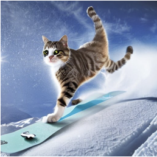

# Deep Learning 2 - Socratic Image Generation

> Jona Ruthardt, Theodora-Mara Pîslar, Valentinos Pariza, Andreas Giorkatzi, Sławomir Garcarz
> 

# Introduction

The [advent](#methodology-digest) of recent generative image models (e.g., DALL·E [^DLE]) has allowed any user to creatively express themselves using arbitrary textual prompts. However, it is often required to do extensive trial-and-error-based prompt engineering to obtain high-quality generations that are aligned with the user intent.

We address this problem, by expanding the notion of Socratic Models [^SM] to the image generation task. Through combining various multi-model pre-trained models, we can leverage the generic real-world knowledge contained in large language models to verify and continuously improve the generation performance and ultimately end up with images that are more in line with user expectations.

### Naive Illustration of Notion

To illustrate this objective, consider the following example: a user wants to generate an image of a *“cat on a snowboard”*. When plugging this prompt into an image generator, the following output is obtained:

While this image bears some relation to the original prompt, it arguably might not reflect the kind of depiction the user desired as the human intuition would presumably not picture a cartoonish version given the text snippet. By leveraging the more human-aligned propensities of large language models, the appearance and elements of the current image can be considered to propose a prompt that is probable to result in more desirable results. For the above image which could, for instance, be transcribed as *”a skateboard with a cartoon cat on top of it”*, the language model could propose a prompt such as “Create an image of a cat riding a snowboard on a snowy mountain terrain.” This improved prompt does yield a supposedly more preferable image:

The remainder of this blog post will be kicked off by further expounding on the notion of Socratic Models and their relation to the novel proposed prompt optimization approach. We furthermore detail the motivation for working on the presented problem and briefly outline previous work in this domain. After giving a detailed introduction to the processing pipeline enabling the generation of improved prompts, the attention is shifted towards the methodology of evaluating the performance and effectiveness of the proposed approach. 

---

## Socratic Models

### Methodology Digest

The authors of the paper [*Socratic Models: Composing Zero-Shot Multimodal Reasoning with Language*](https://arxiv.org/pdf/2204.00598.pdf) [^SM] propose the concept of multimodal zero-shot reasoning, which involves the integration of different modules such as Visual Language Models (VLM), Language Models (LM), Audio Language Models (ALM) or User Input. Through the utilization of outputs from prior modules, the different models can communicate with one another by means of natural language to exchange information. The idea of the paper is inspired by the Socratic method of provoking a cooperative and argumentative dialogue between individuals to exchange information. Similarly, in their research, the modules engage in such exchanges, justifying the name of the paper. The authors illustrate the potential of their approach in applications such as image captioning, robot perception, or multi-modal conversations.

### Strengths

Thanks to the increasing abundance and (public) availability of large and powerful foundation models, the strategy of integrating various (multi-modal) models into a common framework to jointly solve a specific task attracts evermore interest.

The vast variety of different use cases proposed and showcased by Zeng et al. [^SM] illustrates the broad applicability and universal potential of multi-modal zero-shot reasoning. Not requiring any additional task-specific data for fine-tuning dramatically reduces the effort of deploying Socratic Models and makes them suitable areas still suffering under a lack of large volumes of high-quality data. In their experiments, Socratic Models managed to outperform task-specific approaches in a zero-shot setting across multiple use cases. This is not least explained by the ability to draw on commonsense knowledge captured within the foundational models during their comprehensive and cross-domain pre-training paradigm.

Using natural language as the modality of communication between the individual modules facilitates the interpretability of intermediate reasoning steps and exchanged information.

### Limitations

While the merits of combining multiple large-scale foundation models are apparent by virtue of the impressive zero-shot performance of the Socratic Models on various tasks, utilizing such models incurs high computational expenses during inference that might offset the cost of training smaller but task-specific models.

Moreover, the respective performance of each individual module acts as an upper bound for the overall effectiveness of the framework. Especially the performance of the main language component is critical due to its responsibility for most of the reasoning and decision-making which could quickly render it a major bottleneck for the entire prediction pipeline.

If the availability of sufficient data is no concern for a particular application and generalization capabilities beyond the training distribution are not required, reverting to task-specific approaches might still be a desirable line of action. Especially when the task does not hinge on complex reasoning capabilities and vast world knowledge, there appear to be long-hanging fruits that can better be exploited through fine-tuning. This claim is reinforced by the experiments conducted in the Socratic Models paper that highlight that fine-tuned models are still able to (notably) outscore their Socratic counterparts. 

The communication between models operates by means of natural language. For one, this presupposes the ability of each sub-module to act on (partially) text-based inputs if information from other models is required. Furthermore, language - while semantically dense - fails to capture nuances and potentially relevant clues across other modalities such as images. Another drawback of the proposed Socratic Models is the reliance on hand-crafted and empirically determined text templates that define and steer the model’s propensities. 

### Reflection and Discussion

The paper proposes a novel framework for interchanging information between independent pre-trained modules via textual prompts, demonstrating promising results for future development in this direction. However, the evaluation chosen may not be entirely reflective of the power of multimodal reasoning in the applications shown and it may be recommended that new evaluation metrics are developed to more accurately assess the capabilities of these multimodal systems.

---

## Motivation

- [x]  *Exposition of its weaknesses/strengths/potential which triggered your group to come up with a response.*

Due to the multi-modal nature and required world knowledge to address this problem, the notion of Socratic Models lends itself as a guiding conceptual framework for our undertaking. Therefore, we propose a novel processing pipeline specifically adapted for the purpose of obtaining improved image generations as an extension of this concept to yet another application domain. 

Thanks to the zero-shot characteristics of Socratic Models, we are able to use large image generation, image captioning, and language models that would otherwise be computationally unfeasible and capitalize on their better generalizability and performance.

---

## Related Work

Our work depends primarily on the Socratic models[^SM] (SM). SMs describe a framework in which multiple pretrained models that could comprise different modalities are composed in a zero-shot fashion to solve a given task by mutually exchanging information. Previously, Socratic Models have been successfully applied in domains such as free-form question answering, multi-modal dialogue, or robot planning [^SM]. Despite the use of SMs as the core idea of our work, our approach tries to improve the generation of an image from a prompt which is a problem that has been studied a lot in the last few years. For instance, Generative image models such as DALL-E [^DLE] and StableDiffusion ([^SD]) are some of the models we try to improve upon, and which have achieved remarkable progress in generating high-quality images from text-based prompts and have shown potential in a variety of applications. However, lack of realism, limited contextual understanding, and misalignment between user intent and the generated results are still common issues that often require extensive prompt engineering to be eliminated. Consequently, there is an increasing interest in automatically optimizing the model prompts such that the generated images reflect better the reality, the ask, and the user preferences. Existing works either specifically train models to generate more suitable prompts (e.g., [^HP]), fine-tune on existing manually created prompts (e.g., [^OP]), or focus on improving performance only along one specific dimension (e.g., [^ReP]). Last, most methods lack a direct feedback mechanism that can provide information about the reasonability of the generated image and the need for (further) prompt optimization. Our work attempts to use SMs to investigate the potential of solving some of those issues.

---

# Methodology

- [x]  *Describe your novel contribution*

In essence, the proposed framework is comprised of three large pre-trained models as depicted in the Figure below. Based on a user-defined target prompt, an image is generated by the image generator. To identify a potential mismatch between user prompt and generation, a caption of the generated image is created using an image captioning model. Using predefined templates, it is now possible to approximate the similarity of prompt and image caption and potentially propose an alternative prompt that might lead to an improved result. The proposed prompt is then fed back into the generation model in place of the user prompt. This cycle can be continued multiple times until a termination criterion is met (e.g. sufficient similarity between the user prompt and generated image or the maximum number of cycles).

### Image Generator

The image generator is a model that receives a text prompt and generates an image corresponding to that prompt. In our case, it plays a pivotal role in the pipeline as it is one of the two models that connect the text with an image to be optimized. ~~Being conditioned on a textual input, the model generates an image in accordance with the provided prompt~~. The prompt given to the model could either be the original user prompt or an optimized version that was generated based on a previous execution of the pipeline.

Due to its open-source availability and demonstrated effectiveness in generating high-quality images, StableDiffusion-based [^SD] image generators were used.

While generally being pre-trained on large image-captioning datasets, these diffusion models could still exhibit biases towards generating images of a specific style, appearance or degree of realism. Ideally, these emergent propensities should be compensated by generating more expressive and specific prompts by the proposed pipeline, as well as by tuning some of the parameters of the models (i.e., guidance_scale which forces the generation of images better match the prompt with the cost of sacrificing diversity).

### Image Captioning

In order to provide the language model with the necessary visual context to make an informed decision on how to improve the prompt based on the already generated image, a captioning module is introduced that predicts the most likely image caption. 

[BLIP-2](https://huggingface.co/blog/blip-2) is used for the zero-shot image-to-text model, as it bridges the modality gap between vision and language tasks. It makes a good choice for the captioning model as it is open-source and has proven to achieve state-of-the-art results on multiple vision-language tasks.

As an alternative to having this separate module, future work could also explore forgoing the captioning step by using multi-modal language models that directly integrate visual embeddings into their reasoning. In doing so, an potential performance bottleneck could be removed and the loss of information inherent to transcribing an image into text form would be avoided. 

### Large Language Model

Bearing the primary reasoning and decision-making role, the language model is at the core of understanding the semantical correspondence between the generated image and the original user prompt as well as proposing improved prompts on that basis. Consequently, it needs to correctly model the user’s intent, identify whether the current depiction is already sufficiently similar, and make a decision on how the prompt could be improved to yield a more user-aligned image. As many of the characteristics desirable in this application (e.g., reasoning, instruction following, etc.) are shown to be emergent in language models of certain scales [^EA], it is essential to utilize a language model of appropriate size and capability. 

Despite a plethora of choices when it comes to large language models (LLMs), the choice was ultimately made in favour of ChatGPT [TODO] for its still comparative recency, the exhibited performance across various domains and straightforwards API-based availability. 

**Templates**

One prerequisite for making the LLM create improved versions of the prompt is the design of templates to query it accordingly.

When using models via the OpenAI API, two template types are distinguished. The following depicts an exemplary system prompt to prime the LLM towards its assignment:

> TODO TEMPLATE FOR SYSTEM PROMPT OPTIMIZATION
> 

In contrast, the main template incorporates the context from the original user prompt as well as the caption of the previously generated image and restates the main objective:

> TODO TEMPLATE FOR PROMPT OPTIMIZATION
> 

Depending on the exact LLM utilized, slight changes to the contents and formulations of the templates are warranted. While models fine-tuned on human feedback (e.g., ChatGPT) seem to benefit from instructional and commanding prompts, a more neutral and descriptive emphasis is required for models solely trained on next-character prediction. 

Similarly to [^SM], also here the manual creation and empirical exploration of suitable template styles are required. Though underlying shortcomings in the design of a given template can be identified in many cases by analyzing the resulting optimized prompts and generated images, the illimitable conceivable means of encoding the task into a text-based template and intransparent effect on the image generation process make a rigorous and well-informed creation of templates challenging. Thus, the investigation of meta-learning approaches to forgo fixed human-crafted templates is a promising direction to be explored in future work. 

Depending on the specification of the templates, even more prior knowledge can be incorporated to elicit more informed improvements. For instance, the history of previous prompts and captions could be included to account for how previous suggestions and changes to the original user prompt affected the generated result. Additionally, prepending examples of successful prompt enhancements could be effective guidance and lead to faster and more reliable convergence by tapping into the in-context learning capabilities of LLMs.

### **Early Stopping**

Operating in an iterative manner, there is no underlying limitation restricting how often the main loop of the pipeline could be executed for a given user prompt to consecutively improve the generated results. With the main objective of the proposed framework being the generation of images that are aligned with the user’s intent, it might not be necessary to further optimize the prompt given an image that already matches the specified requirements and presumed expectations. Continuing to generate optimized prompts might not yield improved results or could end up even deteriorating the generation quality when the LLM is impelled to make changes despite the caption already matching the user prompt closely.

To mitigate this problem, we propose a termination criterium that is determined to integrate smoothly into the already existing processing pipeline. Using the original user prompt as well as the caption generated for the current image, the reasoning capabilities of the LLM are exploited to determine whether both inputs are sufficiently similar or whether another optimization step is necessary and advantageous. We accomplish this by designing the following separate template that encourages the model to output “*yes*” in case it deems the user prompt and caption to be similar enough and “*no*” otherwise. 

> TODO TEMPLATE FOR SIMILARITY
> 

Due to a lack of access to actual logit values when utilizing LLMs via APIs, the model’s output is simply checked for the occurrence of the substring “*yes*”. As the termination criterion might not be triggered in all cases, a maximum number of optimization steps is defined after which the process is terminated irrespective of the image’s quality. 

### Automatic Sample Selection

Ideally, the generated images after each pass through the pipeline’s loop should be objectively superior to those created during previous iterations. Since designing prompts is no trivial and fully comprehensible matter, this must not necessarily be always the case. Furthermore, the generation process is highly stochastic and even the same prompt might yield results of various grades for different seeds. 

Therefore, we also investigate the means of selecting the best image to present to the user without the set of previously generated ones. In a similar fashion to the aforementioned approach used to evaluate a termination criterion, we again utilize LLMs for this purpose. Given the already generated captions, the LLM is tasked to decide which one matches the user prompt most closely. The following templates are examples of how to formalize the LLM’s assignment:

> TODO TEMPLATE FOR SYSTEM PROMPT SAMPLE SELECTION
> 

> TODO TEMPLATE FOR PROMPT SAMPLE SELECTION
> 

This LLM-based approach is not the only conceivable termination criterium, however. Alternatively, scoring via CLIP could be employed where the images are encoded and compared with the encoded user prompts. The image-prompt pair most closely together in the shared latent space can be assumed to be the best visual representation of the original query. A multi-modal LLM could offer the additional advantage of incorporating textual and visual clues directly into a very powerful general-purpose model to identify the most similar combination without requiring a separate CLIP-based module. 

# Experiments

This section is concerned with evaluating the performance to get insights into the efficacy and suitable use cases for the proposed framework. Since the task of prompt optimization itself and the specific approach that does not involve any parameter optimization employed here are fairly novel, there is no well-established evaluation methodology on which we could fall back on. 

Moreover, manifold characteristics that are inherent to the objective of the task make evaluation more challenging. For one, the visual semantic space is vast and for a given textual input, various images are conceivable. Having images with notably different appearances that can represent a prompt similarly well necessitates methods which assess the inputs on a more abstract and conceptual level. In addition to assessing the correlativity between user prompt and generated result, also image-specific aspects like an aesthetic and realistic appearance have to be considered. While one of the major objectives of this line of research is to investigate if the proposed approach can generate more user-aligned images, such human preferences are inherently subjective and subsequently challenging to measure and quantify. Another question is which datum to choose to measure performance (differences) between model configurations. Despite the having the most control over the LLM-based prompt optimization procedure through the design of miscellaneous templates and the crucial role this module plays in the pipeline, the quantity that ultimately is to be optimized is the generated image itself. 

Notwithstanding the largely unchartered territory of evaluating the proposed pipeline, some inspiration can be drawn from previous works. The remainder of this section will detail the methodology utilized to qualitatively and quantitatively asses the approach’s effectiveness.

## Evaluation Data

Yet another challenge surfaces when it comes to the type of dataset to use for evaluation. In principle, there are two main classes of datasets that can applied in this situation.

### Prompt Datasets

Most closely aligned with the objective of the proposed approach are datasets that are intentionally created or accrued for image generation. 

Due to containing more then 14 million pairs of user prompts and generated images, DiffusionDB [^DDB] is a common dataset choice especially if any training or fine-tuning is required (e.g. [^OP]). The large size comes with no oversight and adequate supervision over the data’s quality, however. Additionally, interacting with the image generation pipeline that was used to collect data presupposes a certain technical sophistication that novice user likely not possess. This bias towards more advanced and knowledgeable users will consequently also be reflected in the type and style of prompts. 

The PartiPrompts dataset [^PP], on the other hand, is comprised of 1600 hand-crafted prompts specifically designed to stress performance on challenging generation tasks. Despite the considerably smaller size, it still encompasses prompts across a multitude of different categories and levels of abstraction and complexity. 

Because of these properties and the high overall quality, PartiPrompts was used as the prompt-based dataset of choice.

### Image Captioning Datasets

In contrast to the much more recent emergence of prompt datasets, the task of image captioning and corresponding datasets have been ubiquitous for some time now. With both large-scale datasets based on web-scraped image-caption pairs and ones humanly annotated by experts readily available, choices for the specific kind of dataset abound. Moreover, while presumably constituting a certain distributional discrepancy from the types of prompts fed into image generators by end users, these datasets are usually more representative of the entire space of conceivable images and more akin to the data image generators were trained on. 

Chosen because of its general and human-generated nature, the COCO Captions dataset [^CC] was used as the surrogate of this second class of datasets. 

TODO: Detail sub-sampling strategy and final dataset configuration

## Qualitative Evaluation

- human evaluation
- a survey where people select which generated image would best suit their preferences

## Quantitative Evaluation

Despite human appraisals being the ultimate benchmark for the suitability of the proposed approach, acquiring such measurements is an expensive endeavor and not scalable for more comprehensive analysis of the framework’s properties. Moreover, subjective preferences are inherent to the qualitative evaluation process and can bias or sway results if not accounted for or averaged over sufficient sample size. Consequently, more rigorous quantitative methods are required that mitigate these shortcomings.

The general appearance and aesthetic composition of an image can be assessed by no-reference metrics (e.g., NROM, BRISQUE) or distribution metrics (e.g., FID, IS). These approaches fail to gauge the correspondence between original prompt and generated image, however. Therefore, the following will detail two methods that measure the similarity between different reference quantities and the generated image.

### CLIPScore

One commonly used metric (e.g., [^OP], [^ReP]) to score the similarity between an image and corresponding text is the CLIPScore as proposed in [^CS]. Due to its high correlation with human judgements, this metric is well geared for this application. Additionally, it was shown to outperform more traditional reference-based metrics such as SPICE [^CS]. 

The CLIPScore is calculated using the cosine similarity between an embedded image $\textbf{v}$ and an embedded text feature $\textbf{t}$ with a $\max$-function and an empirically determined $w=2.5$ to restrain the scores to $s \in [0,1]$:

$$
\text{CLIPScore}=w*\max(\cos(\textbf{v},\textbf{t}),0)
$$

Thanks to the nature of it’s pre-training objective, images and text that are semantically similar are more closely arranged in the shared latent space und subsequently yield higher scores. The reported CLIPScores where generated using the ViT-B-32 variant of the OpenCLIP model [^OC]. 

### Image Similarity

Given a textual prompt, the objective of the proposed framework is to generate an corresponding image. When drawing on captioning datasets to extract user prompts, a proxy target in the form of the image on which basis the caption was created is arguably already available. Therefore, an alternative measure of the approach’s efficacy may reside in the comparison of the generated and the reference image. Assessing the similarity of images is no trivial feat, however, especially when being conditioned by a reference text. Since captions usually omit many specific and visually decisive pieces of information, multitudinous depictions with vastly differing overall appearances might similarly align with the prompt. 

To address this challenge, both images are mapped into a semantically more expressive latent space using previously specific OpenCLIP [^OC] image encoder. The cosine similarity between the resulting feature vectors is then taken as a measure of how well the generated image corresponds to the reference. 

### Number of Improvement Cycles

## Ablation Study

### Template Design

### Early Stopping

### Image Captioning Module

# Results

- [ ]  *Results of your work*

# Conclusion

- [ ]  Takeaways from this work

In addition to the limitations inherent to the notion of Socratic Models previously already outlined, the application of such an approach to prompt optimization in particular comes with some further challenges and drawbacks.

## Contributors

### Jona Ruthardt

- XXX
- Focus: Pipeline and Evaluation
- Research and Development

### Theodora-Mara Pîslar

- XXX
- Focus: Image-to-Text and Evaluation
- Research and Development

### Valentinos Pariza

- XXX
- Focus: Pipeline, Text-to-Image and Evaluation
- Research and Development

### Andreas Giorkatzi

- XXX
- Focus: LLMs and Evaluation
- Research and Development

### Slawomir Garcarz

- XXX
- Focus: LLMs and Evaluation
- Research and Development

# References

[^SM]: Andy Zeng et al. Socratic Models: Composing Zero-Shot Multimodal Reasoning with Language. 2022. [https://arxiv.org/abs/2204.00598](https://arxiv.org/abs/2204.00598)

[^SD]: Robin Rombach et al. High-Resolution Image Synthesis with Latent Diffusion Models. 2022. [https://arxiv.org/abs/2112.10752](https://arxiv.org/abs/2112.10752)

[^EA]: Jason Wei et al. Emergent Abilities of Large Language Models. 2022. [https://arxiv.org/abs/2112.10752](https://arxiv.org/abs/2206.07682)

[^OP]:  Yaru Hao et al. Optimizing Prompts for Text-to-Image Generation. 2022.

[https://arxiv.org/pdf/2212.09611](https://arxiv.org/pdf/2212.09611.pdf)

[^DLE] Alec Radford et al. Learning Transferable Visual Models From Natural Language Supervision. 2021. arXiv: 2103.00020 [cs.CV].

[^ReP] Yunlong Wang, Shuyuan Shen, and Brian Y Lim. “RePrompt: Automatic

Prompt Editing to Refine AI-Generative Art Towards Precise Expressions”.

In: Proceedings of the 2023 CHI Conference on Human Factors in Com-

puting Systems. ACM, Apr. 2023. doi: 10.1145/3544548.3581402. url:

https://doi.org/10.1145%2F3544548.3581402.

[^HP] Yuxin Wen et al. Hard Prompts Made Easy: Gradient-Based Discrete Op-

timization for Prompt Tuning and Discovery. 2023. arXiv: 2302 . 03668

[cs.LG].

[^] Aditya Ramesh et al. Zero-Shot Text-to-Image Generation. 2021. arXiv:

2102.12092 [cs.CV].

[^] Tristan Thrush et al. Winoground: Probing Vision and Language Models

for Visio-Linguistic Compositionality. 2022. arXiv: 2204.03162 [cs.CV].

[^] Andy Zeng et al. Socratic Models: Composing Zero-Shot Multimodal Rea-

soning with Language. 2022. arXiv: 2204.00598 [cs.CV]

[^CS]: Jack Hessel et al. CLIPScore: A Reference-free Evaluation Metric for Image Captioning. 2022. [https://arxiv.org/abs/2104.08718](https://arxiv.org/abs/2104.08718)

[^OC]: Gabriel Ilharco et al. OpenCLIP. 2022

[^PP]: Jiahui Yu et al. Pathways Autoregressive Text-to-Image (Parti) - PartiPrompts Dataset. 2022. https://github.com/google-research/parti

[^DDB]: Jay Wang et al. Large-Scale Prompt Gallery Dataset for Text-to-Image Generative Models. 2022. [https://arxiv.org/abs/2210.14896](https://arxiv.org/abs/2210.14896)

[^CC]: Xinlei Chen et al. [Microsoft COCO Captions: Data Collection and Evaluation Server](https://paperswithcode.com/paper/microsoft-coco-captions-data-collection-and). 2015
