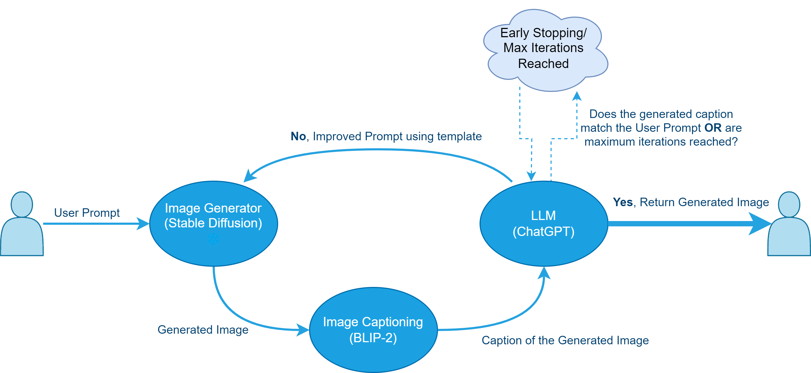
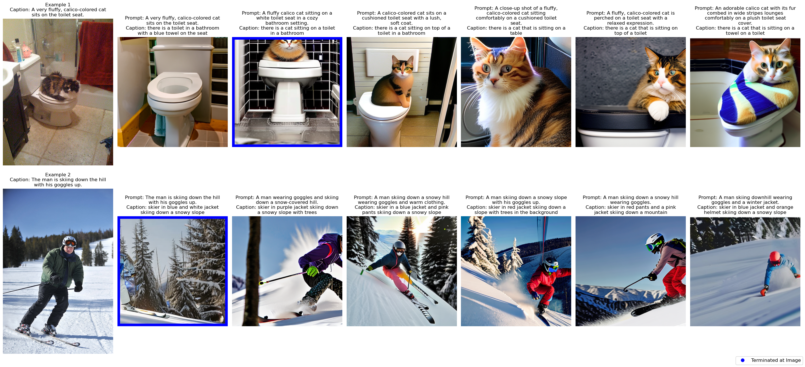
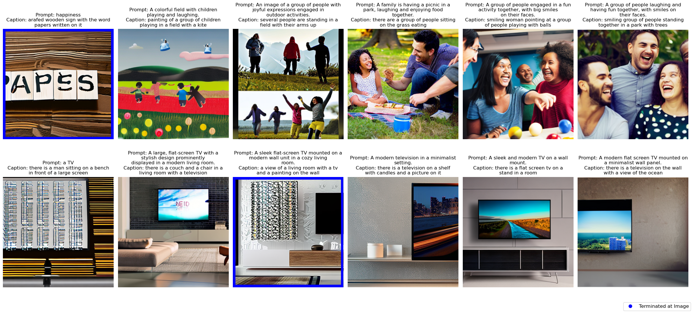
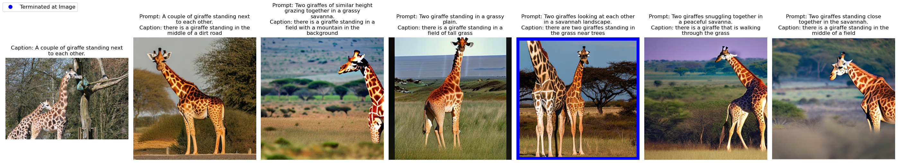
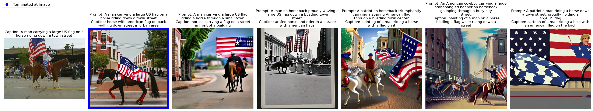
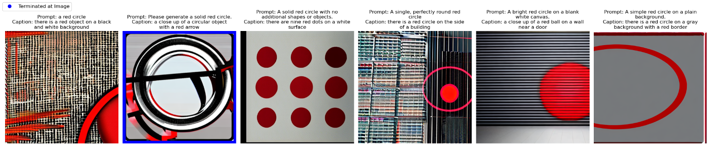
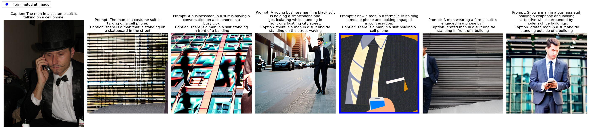
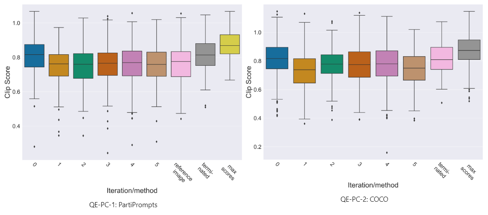
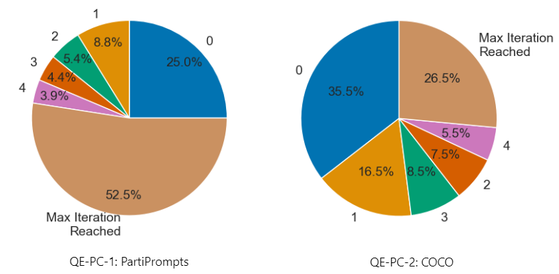

# Socratic Image Generation

> Jona Ruthardt, Theodora-Mara Pîslar, Valentinos Pariza, Andreas Giorkatzi, Sławomir Garcarz
> 

# Introduction

The advent of recent generative image models (e.g., DALL·E [^DLE]) has allowed any user to creatively express themselves using arbitrary textual prompts. However, it is often required to do extensive trial-and-error-based prompt engineering to obtain high-quality generations that are aligned with one’s intent.

We address this problem by expanding the notion of Socratic Models [^SM] to the image generation task. By combining various multi-model pre-trained models, we attempt to leverage the generic real-world knowledge contained in large language models to verify and continuously improve the generation performance through optimizing prompts so as to ultimately end up with images that more closely align with user expectations.

### Illustrative Example

To illustrate this objective, consider the following example: a user wants to generate an image of a *“cat on a snowboard.”* When plugging this prompt into an image generator, the following output is obtained:

<div style="text-align: center;">
    
</div>

While this image bears some relation to the original prompt, it arguably might not reflect the kind of depiction the user desired as the human intuition would presumably not picture a cartoonish version given the text snippet. By leveraging the more human-aligned propensities of large language models, the appearance and elements of the current image can be considered to propose a prompt that is probable to result in more desirable results. For the above image, which could, for instance, be transcribed as *”a skateboard with a cartoon cat on top of it,”* the language model did propose a prompt such as *“Create an image of a cat riding a snowboard on a snowy mountain terrain.”* This improved prompt does yield a supposedly more preferable image:

<div style="text-align: center;">
    
</div>

We propose a novel processing pipeline adapted explicitly to obtain improved image generations as an extension of this concept to a previously unexplored application domain. Thanks to the zero-shot characteristics of Socratic Models, we can use large image generation, image captioning, and language models that would otherwise be computationally unfeasible and capitalize on their better generalizability and performance.

The remainder of this blog post will be kicked off by further expounding on the notion of Socratic Models and their relation to the proposed approach. We furthermore detail the motivation for working on the presented problem and briefly outline previous work in this domain. After an introduction to the main processing pipeline, the attention is shifted toward evaluating the proposed approach's performance and effectiveness.

## Socratic Models

### Methodology

Zeng et al. [^SM] proposed the concept of multimodal zero-shot reasoning by integrating different modules such as Visual Language Models (VLM), Language Models (LM), Audio Language Models (ALM), and User Input. Using outputs from prior modules, the different models can exchange information through natural language. The paper draws inspiration from the Socratic method, fostering cooperative and argumentative dialogue to uncover profound insights. Similarly, the individual modules engage in such exchanges. The potential of this framework is demonstrated in applications such as image captioning, robot perception, or multimodal conversations.

### Strengths

Thanks to the increasing (public) availability of large and powerful foundation models, integrating various (multimodal) models into a common framework to solve a specific task jointly attracts evermore interest.

The wide variety of use cases proposed and showcased by Zeng et al. [^SM] illustrates the broad applicability and universal potential of multimodal zero-shot reasoning. Not requiring additional task-specific data for fine-tuning dramatically reduces the cost of Socratic Models and makes them suitable for areas lacking plentiful high-quality data. In their experiments, Socratic Models outperformed task-specific approaches in a zero-shot setting across multiple use cases. This is not least explained by the ability to draw on commonsense knowledge [^COT].

Using natural language as the communication modality between the individual modules facilitates the interpretability of intermediate reasoning steps and exchanged information.

### Limitations

While the merits of combining multiple large-scale foundation models are apparent by the impressive zero-shot performance of Socratic Models on various tasks, utilizing such large-scale models incurs high computational expenses during inference that might offset the cost of training smaller but task-specific models.

Moreover, the respective performance of each module acts as an upper bound for the overall effectiveness of the framework. Especially the performance of the main language component is critical due to its responsibility for most of the reasoning and decision-making which could render it a major bottleneck.

If the availability of data is no concern and generalization capabilities beyond the training distribution are not required, reverting to task-specific approaches might still be a desirable line of action. Especially when the task does not hinge on complex reasoning capabilities and vast world knowledge, there appear to be low-hanging fruits that can better be exploited through fine-tuning [^SM].

Exchanging information by means of natural language presupposes the ability of each sub-module to act on (partially) text-based inputs if information from other models is required. Furthermore, language - while semantically dense - fails to capture nuances and potentially relevant clues across other modalities. Another drawback of the Socratic Models is the reliance on hand-crafted and empirically determined text templates based on which the inter-module communication is steered.

## Related Work

Despite SMs being the core framework behind this work, the main problem is improving the generation of a prompt-conditioned image. For instance, Generative image models such as DALL-E [^DLE] and StableDiffusion [^SD] have achieved remarkable progress in generating high-quality images from text-based prompts and have shown potential in a variety of applications. However, lack of realism, limited contextual understanding, and misalignment between user intent and the generated results are still common issues that often require prompt engineering to be eliminated. Consequently, there is an increasing interest in automatically optimizing the model prompts such that the generated images better reflect reality, the prompt, and user preferences. Existing works either specifically train models to generate more suitable prompts (e.g., [^HP]), fine-tune existing manually created prompts (e.g., [^OP]), or focus on improving performance only along one specific dimension (e.g., [^ReP]). Lastly, most methods lack a direct feedback mechanism that can provide information about the reasonability of the generated image and the need for (further) prompt optimization. Our work attempts to use SMs to investigate the potential of solving some of those issues.

# System Design

The proposed framework comprises three large pre-trained models, as depicted below. Based on a user-defined target prompt, an image is generated by the image generator. A caption of the generated image is created using an image captioning model to extract semantic information and translate them from the visual into the language domain. Using predefined templates, it is now possible to approximate the similarity of prompt and image caption and potentially propose an alternative prompt that might lead to an improved result. The proposed prompt is then fed back into the generation model instead of the user prompt. This cycle can be continued multiple times until a termination criterion is met (e.g., sufficient similarity between the user prompt and generated image or the maximum number of cycles).



### Image Generator

The image generator in our pipeline is designed to generate an image based on a given text prompt. 

Diffusion models currently represent the pinnacle of text-to-image approaches [^LTGM]. One representative of these models is the family of publicly available Stable Diffusion Models (e.g., v1.4, v1.5, v2.1). While they produce high-quality and diverse images, their performance can vary greatly. They often struggle with fine-grained accuracy in the pixel space, resulting in the generation of unrealistic and unrelated images. We examine these issues and assess their impact on our overall pipeline. The specific model utilized was StableDiffusion v2.1 from Stability AI [^SD].

### Image Captioning

In order to provide the language model with the necessary visual context, a captioning module is introduced to predict the most likely image caption. BLIP-2 [^BP] is used for the zero-shot image-to-text model, as it bridges the modality gap between vision and language tasks. It makes a good choice for the captioning model as it is open-source and has proven to achieve state-of-the-art results on multiple vision-language tasks [^BP].

### Large Language Model

Bearing the primary reasoning and decision-making role, the language model is at the core of understanding the semantical correspondence between the generated image and the original user prompt as well as proposing improved prompts on that basis. Our choice ultimately favored ChatGPT (gpt-3.5-turbo) [^GPT] for its still comparative recency, the exhibited performance across various domains, and straightforward API-based availability. Details about our decision can be found in the [Appendix](#choice-of-llm).

**Templates**

One prerequisite for making the LLM create improved versions of the prompt is the design of templates to query it accordingly.

When using models via the OpenAI API, two template types are distinguished. The following depicts an exemplary system prompt to prime the LLM toward its assignment:

> System role template:
> 
> 
> ```
> You are a smart prompt optimization assistant for AI image generation models. 
> 
> Given the original user prompt and a caption of an image that was generated based on this prompt, suggest a prompt that produces a better image.
> Only output the best prompt suggestion phrased as if it was the caption of the desired image and nothing else. 
> 
> Be concise and keep the suggestion short by focusing mostly on what elements the image should contain. Too much information confuses the image generator. Mainly use simple language that is visually meaningful.
> 
> The caption of the previously generated image is there to illustrate potential biases in the generator that should be avoided by designing more accurate prompts if they do not match the user prompt.
> 
> The goal is to generate an image based on the optimized prompt that best matches the user's expectation for his original prompt.
> ```
> 

In contrast, the main template incorporates the context from the original user prompt as well as the caption of the previously generated image and restates the main objective:

> Prompt optimization template:
> 
> 
> ```
> Caption of generated image: <IMAGE_CAPTION>
> Original user prompt: <USER_PROMPT>
> Improved prompt for AI image generation model that produces an image that is more in line with the user's intent:
> ```
> 

Similarly to [^SM], also here the manual creation and empirical exploration of suitable template styles are required. Though underlying shortcomings in the design of a given template can be identified in many cases by analyzing the resulting optimized prompts and generated images, the illimitable conceivable means of encoding the task into a text-based template and the intransparent effect on the image generation process make a rigorous and well-informed creation of templates challenging.

It is important to note that the default pipeline does not consider the prompt history, and each iteration exclusively receives the information provided through the templates. This aspect is deferred for future work.

### **Early Stopping**

Operating in an iterative manner, there is no underlying limitation restricting how often the main loop of the pipeline can be executed. With the main objective of the proposed framework being the generation of images aligned with the user’s intent, it might not be necessary to further optimize the prompt given an image that already matches the expectations. Continued optimization might even deteriorate the generation quality when the LLM is impelled to make changes despite the caption closely matching the user prompt, as we could observe from the qualitative experiments.

To mitigate this problem, we propose a termination criterium that integrates smoothly into the existing processing pipeline. Using the original user prompt and the caption generated for the current image, the LLM is asked to determine whether both inputs are sufficiently similar or whether another optimization step is necessary. We accomplish this by designing the following template that encourages the model to output “*yes*” if it deems the user prompt and caption similar enough and “*no*” otherwise.

> System role for similarity template:
> 
> 
> ```
> You are a smart prompt optimization assistant for AI image generation models.
> Your job is to decide if User prompt and Caption of the generated image after optimization
> are similar enough.
> ```
> 

> Similarity template:
> 
> 
> ```
> Decide if User prompt and Caption of generated image are similar enough. Your answer should be ONLY ONE word: 'Yes' or 'No'.
> User prompt: <USER_PROMPT>
> Caption of generated image: <IMAGE_CAPTION>
> Answer:
> ```
> 

# Experiments

Because of the novel nature of this specific prompt optimization approach, there is no well-established evaluation practice. The task's inherent characteristics make evaluation challenging, as the visual semantic space is vast, and different images can represent a prompt well. Evaluating user alignment and human preferences is subjective and difficult to quantify. Despite the lack of appropriate evaluation methods, inspiration can be drawn from previous works. The rest of this section details the qualitative and quantitative assessment methodology.

## Evaluation Data

Yet another challenge surfaces when it comes to the type of dataset to use for evaluation. In principle, there are two main classes of datasets that can be applied in this situation.

### Prompt Datasets

Most closely aligned with the objective of the proposed approach are datasets that are intentionally created or accrued for image generation. 

DiffusionDB [^DDB] is a common dataset choice especially if any training or fine-tuning is required (e.g. [^OP]). The large size (14 million prompt-image pair) comes with no oversight and adequate supervision over the data’s quality, which makes it not fully appropriate for our task.

The PartiPrompts dataset [^PP], on the other hand, is comprised of 1600 hand-crafted prompts specifically designed to stress performance on challenging generation tasks. Despite the considerably smaller size, it still encompasses prompts across a multitude of different categories and levels of abstraction and complexity. 

Because of these properties and the high overall quality, a total of 200 PartiPrompts were used as the prompt-based dataset of choice.

### Image Captioning Datasets

Contrary to recent prompt datasets, image captioning datasets have long existed, offering diverse options including web-scraped pairs and expert annotations. Although they may differ in distribution from user-generated prompts, these datasets better represent the full range of images and align closely with image generator training data.

Chosen because of its general and human-generated nature, the COCO Captions dataset [^CC] was used as the surrogate of this second class of datasets. Due to its overabundant size, a subset of 200 image-caption pairs was randomly selected from the validation split.

Notably, it is possible to consider the images as a reference of what a user might envision when inputting their caption into the pipeline.

## Quantitative Evaluation

Despite human appraisals being the ultimate benchmark for the suitability of the proposed approach, acquiring such measurements is an expensive endeavor and not scalable for a more comprehensive analysis of the framework’s properties. Moreover, subjective preferences are inherent to the qualitative evaluation process and can bias the results if not accounted for or averaged over a sufficient sample size. Consequently, more rigorous quantitative methods are required that mitigate these shortcomings.

The general appearance and aesthetic composition of an image can be assessed by no-reference metrics (e.g., BRISQUE [^BRISQUE]) or distribution metrics (e.g., FID [^FID], IS [^IS]). These approaches fail to measure the correspondence between the original prompt and generated image, however. 

One commonly used metric (e.g., [^OP], [^ReP]) to score the similarity between an image and corresponding text is the CLIPScore as proposed in [^CS]. Due to its high correlation with human judgments, this metric is suited for this application. Additionally, it was shown to outperform more traditional reference-based metrics such as SPICE [^CS]. 

The CLIPScore is calculated using the cosine similarity between an embedded image $\textbf{v}$ and an embedded text feature $\textbf{t}$ with a $\max$-function and an empirically determined $w=2.5$ to restrain the scores to $s \in [0,1]$:

$$
\text{CLIPScore}=w*\max(\cos(\textbf{v},\textbf{t}),0)
$$

Thanks to the nature of its pre-training objective, images, and text that are semantically similar are more closely arranged in the shared latent space and subsequently yield higher scores. The reported CLIPScores were generated using the ViT-B-32 variant of the OpenCLIP model [^OC]. 

An alternative evaluation approach is the similarity assessment of the user prompt with the generated caption using metrics such as SPICE, BLUE, METEOR, and CIDEr [^SP][^BL][^ME][^CID]. Additionally, when having access to a reference image, also comparing the similarity between it and the generated image is conceivable. However, the qualitative assessment and comparison with our human intuition showed a misalignment of these metrics for this application.

## Qualitative Evaluation

The degree to which the prompt-optimized image improves on the original generation and conforms to the prompt is ultimately up to the user. We conduct a qualitative analysis to evaluate the fidelity of the generated images in relation to the original user prompt. The images highlighted in blue triggered the early stopping criterion

### Best Examples

We illustrate some of the promising visual results produced by the pipeline in Fig. 1 and Fig. 2. It can be observed that the images later generated are more aligned with the reference image than the first generated one. Since converting text to images is subject to many ambiguities, the original image of the dataset can only act as a point of reference but is inadequate for use as a target ground truth.



Figure 1. Illustrative examples using the COCO prompts as input to the pipeline.



Figure 2. Illustrative examples using the Parti prompts as input to the pipeline.

### Erroneous Cases

We observe the presence of erroneous examples of specific patterns which we illustrate in the Figures below. The Stable Diffusion image generator module is recognized as a bottleneck in the overall process, exhibiting several noteworthy limitations. These include a lack of consideration for cardinality (Fig. 3), a bias towards cartoonish images (Fig. 4), difficulties in capturing smaller yet semantically important details (Fig. 5), and a Bag-of-Words (BoW) behaviour leading to inconsistent interpretation of prompts, observed in the first generated image of Fig. 4. The generated images often fail to reflect the entire prompt, even when clear and verbose instructions are given. As a result, this also leads to misleading captioning because, from the erroneously generated images, the captioning model produces outputs that are not aligned with the user prompt. Such an example can be seen in Fig. 6.



Figure 3. Visualization of the cardinality limitation of the Stable Diffusion model.



Figure 4. Visualization of the bias towards cartoonish images of the Stable Diffusion model.



Figure 5. Visualization of the inability of the Stable Diffusion model to capture significative details from a prompt.



Figure 6. Visualization of the image captioning model biasing the image generation. In this particular example, it biases it by adding the idea of having a building in further generations, even though that was not the initial intent.

On the other hand, the LLM module exhibits an impressive capacity to generate new prompts which are reasonable from a human perspective and should yield higher-quality results if duly acted upon by the image generator.

## Quantitative Experiments

Besides the qualitative evaluation of the pipeline developed, a more quantitative approach is followed to understand the potential performance of the model. More specifically, the pipeline was executed for a total of five optimization iterations for both datasets (COCO and PartiPrompts) and the CLIPScore was reported at the end of each iteration between the user prompt and the respective image. Last, the LLM-based early stopping heuristic and an aggregated maximum score out of all generated images were considered here.

### Potential benefit of each Pipeline’s iteration

<div>
    <div style="text-align: center;">
        
    </div>
</div>

The figures above show the CLIPScores between the image obtained from different stages for the COCO Dataset (Left) and the PartiPrompt (Right). Both of the Figures allow for some noteworthy observations, which we describe below:

**First iteration yields the highest CLIPScore than other iterations on average**:

The generated image of the first iteration (iteration 0), on average, has a higher CLIP score than all the other iterations. Stopping at the first iteration consistently yields the best performance, indicating that it is better than the different individual iterations. In general, there is no continuous improvement by running for more iterations after the first one (iteration 0). Still, it can sometimes be beneficial if the pipeline continues for more iterations (discussed below).

**There is a better approach than always using the results of the first iteration:**

The CLIPScores in the first iteration (iteration 0) are lower than the average maximum scores of any iteration. This shows that always considering the first generated image does not give the optimal overall results on average since it might be inaccurate or faulty in some way, whereas further fine-tuning of the prompt might lead to generating an image that better represents the initial intention of the prompt. Another interesting point is that in 64.6% of cases, the CLIPScore in iteration 0 was strictly higher compared to later iterations (1 to 5). This further justifies our motivation that there is indeed a benefit in trying to generate a better image beyond the initial one given an optimized prompt.

**Termination step achieves comparable or better to first Iteration CLIPScores:**

The CLIPScore between the image and the user prompt at the terminated step of our pipeline is, on average, very close to the CLIPScore between the image in the first step and the user prompt. More specifically, the CLIPScore in the terminated iteration is slightly higher. This shows that in terms of CLIP Score, the current pipeline with the termination step of early stopping and max iterations of 5 can accomplish at least the same quality of images as the first iteration or even higher. Consequently, the average maximum scores suggest that there can be an improvement, even surpassing the results from the first iteration.

**CLIPScores of reference images are lower than images at the terminated step:**

The CLIPScore between the reference image of the COCO dataset and the user prompt is lower compared to the CLIPScores of the results in the first iteration and the iteration of (early) termination. Notably, the terminated image's CLIPScore surpasses that of the original dataset, indicating the pipeline's potential to generate a more representative image with the optimized prompt compared to the manually annotated dataset caption. However, this metric is not a definitive measure for evaluating the pipeline's performance.

**Using early stopping tends to lead to better overall results:**

Last, we want to report that the percentage of times the terminated image is the one with the maximum is 25% in the COCO dataset and 23% in the Parti Dataset. While demonstrating some effectiveness by exceeding chance already, this also shows much room for further improvement to allow the pipeline to stop at an iteration that generates an image that better aligns with the user prompt.

### Potential Benefit of Early Stopping

<div>
    <div style="text-align: center;">
        
    </div>
</div>

The pie charts above depict the percentage of iterations in which the stopping criterion was triggered (sufficient similarity or maximum iterations reached) for the PartiPrompts Dataset (left) and the COCO dataset (right). Based on this, the following observations can be made:

**Early Stopping is decreasingly applied as iterations progress**:

In both cases, the early stopping follows a descending occurrence frequency with the number of iterations.

**On the PartiPrompts Dataset, early stopping is not applied in more than half of the cases**:

For PartiPrompts, the early stopping fails to be triggered in 52.5% of examples compared to 26.5% in COCO.

Based on these two observations, it is clear that the early stopping is applied at least around half of the time with an iteration stopping of 5 iterations. The previous section demonstrated the high but non-optimal quality attained in the first iteration. Thus the question emerges: “Does the early stopping provide images with higher or equal CLIPScores than the ones from iteration 0?”. We observed that 58.5% of the time the early stopping was triggered (62% on COCO and 54.9% on PartiPrompts), the CLIPScore was higher or equal to the CLIPScore of the first iteration. This indicates the effectiveness of employing the proposed early stopping heuristic and the benefit of the pipeline to obtain better results on average.

## Ablation Study

### Template Design

The creation of templates involved the continuous refinement of textual (system) prompts for the LLM based on adverse effects detected when browsing through previous results. In doing so, several factors with negative influences were detected and addressed by additional text blocks in the templates:

- **Format:** LLM outputs sometimes contained multiple prompt suggestions or inquiries for more information
→ *“Only output the best prompt suggestion phrased as if it was the caption of the desired image and nothing else.”*
- **Verbosity:** optimized prompts tended to be wordy
→ *“Be concise and keep the suggestion short by focusing mostly on what elements the image should contain. Too much information confuses the image generator.”*
- **Orotundity:** optimized prompts often contained highfalutin and visually uninformative words
→ *“Mainly use simple and concrete language that is visually meaningful.”*

In order to determine the effect of each of these problem mitigations, they were ablated in turns. The following tables detail the respective performance differences when compared to the full template. Naturally, the removal of combinations of text blocks is probable to have compounding effects leading to notably worse performance still. 

| COCO | CLIPScore at Termination | Early Stopping [%] | Maximum CLIPScore |
| --- | --- | --- | --- |
| Original Template | **0.798** | **73.5** | **0.875** |
| Format | 0.789 | 68.5 | 0.869 |
| Verbosity | 0.789 | 68 | 0.871 |
| Orotundity | 0.793 | 66.0 | 0.871 |

| PartiPrompts | CLIPScore at Termination | Early Stopping [%] | Maximum CLIPScore |
| --- | --- | --- | --- |
| Original Template | 0.777 | **47.55** | **0.879** |
| Format | 0.766 | 46.57 | 0.873 |
| Verbosity | 0.769 | 44.12 | 0.877 |
| Orotundity | **0.778** | **47.55** | **0.879** |

As is evident from these results, considering the additional text phrases mitigated some of the observed adverse effects as their removal led to decreased scores overall. The sole exception constitutes the *Orotundity* block for the PartiPrompts dataset which could have to do with the more abstract and impalpable nature of the base prompts. 

### Image Captioning Module

During the qualitative analysis, it was apparent that the captioning model occasionally struggles to convey sufficient and diverse semantical details that might be decisive given the specific prompt. To explore the benefit the captions of previous generations provide when included in the prompt optimization process, the templates were altered to not include any caption-related references (i.e. only the user prompt is considered as input). The following tables depict the results of this ablation:

| COCO | CLIPScore at Termination | Early Stopping [%] | Maximum CLIPScore |
| --- | --- | --- | --- |
| Original | **0.797** | **73.5** | **0.875** |
| No caption | 0.751 | 64 | 0.854 |

| PartiPrompts | CLIPScore at Termination | Early Stopping [%] | Maximum CLIPScore |
| --- | --- | --- | --- |
| Original | **0.798** | **73.5** | **0.875** |
| No caption | 0.725 | 49.02 | 0.861 |

A substantial impairment of the approach’s performance is apparent when not providing the LLM with previous captions. This is indicative of the importance of providing insights regarding how the generator actualizes prompts and the fact that the LLM can exploit this information to compensate for unwanted biases in the next prompt iteration.

# Discussion and Future Work

The previously outlined experiments provided first insights into the effectiveness of the proposed approach. Beyond the qualitative assessment undertaken as part of this study, it is advisable for follow-up work to additionally initiate a large-scale user study to confirm whether the prompt-optimized generations do align more with the average user expectation. 

The conducted quantitative experiments provided more rigorous insights into the performance across two different datasets. Through ablation studies, specific configuration and pipeline components were justified. Since a continued and iterative improvement when executing multiple optimization loops did not materialize, using additional heuristics such as early stopping proved decisive for performance maximization. 

The experiments also revealed limitations in various scenarios. Even though the prompt optimizations proposed by the LLM are sensible in the vast majority of cases, the two other sub-modules noticeably constrain the framework's capabilities.

The captioning model regularly fails to extract information that is most meaningful given the specific prompt and focuses on more generic and high-level transcriptions. Nonetheless, supplying the LLM with this information still proved essential. Future work could explore the LLM-based generation of prompt-specific queries to be answered by multi-modal LLMs or Visual Question Answering models, enabling the retrieval of more specific details relevant to a given prompt.

Despite the limited expressiveness of the captions in many cases, the optimized prompts suggested by the LLM still closely aligned with the user prompt. But even when augmenting the user prompt with particularized aspects that should objectively yield improved results, the image generator is not able to adequately exploit these suggestions. Adding more information does not consistently improve results and can even deteriorate the quality. Consequently, the image generator model constitutes a significant bottleneck and a more pronounced performance benefit can be expected given a more capable model.

Further enhancements to the framework can be explored by incorporating more prior knowledge. For instance, the history of previous prompts and captions could be included to account for how previous suggestions affected the generated result. Prepending examples of successful prompt enhancements could also serve as effective guidance, leveraging the in-context learning capabilities of LLMs.

Nonetheless, utilizing meta templates to task the LLM contradicts the fundamental goal of minimizing manual prompt engineering. Moreover, writing effective prompts for image generation often requires going beyond explicitly specifying scene details. The inclusion of phrases like "DSLR image" or "photo-realistic" can influence models to generate images based on certain high-level visual concepts. While newer language models may become more aware of these challenges due to the inclusion of relevant literature in their training data, a preliminary solution could also involve adding a considerably smaller language model that is specifically fine-tuned and tasked to augment prompts with heuristically auxiliary suffixes.

# Conclusion

This work addressed the recent phenomena of text-conditioned image generation and proposed a novel approach of iteratively optimizing user prompts to yield higher-quality results that are more aligned with user expectations.

By drawing inspiration from the notion of Socratic Models, we designed a pipeline composed of three multimodal components that conjunctly attempt to produce improved image generations.

Owing to the largely unprecedented nature of the task, a rigorous evaluation methodology had to be devised. In the subsequent experiments, a first benchmark for this task was established, and essential characteristics of the method were demonstrated.

While our initial results underlined the feasibility of the proposed approach, promising trajectories for future work abound and encourage further investigations and extensions of this concept. With the growing abundance of AI-based image generation and increasing accessibility to non-technical users, this represents an important research direction that helps to facilitate this development further.

> *"We cannot live better than in seeking to become better."* - Socrates
> 

## Contributors

### Jona Ruthardt

- **Focus:**
    - Pipeline
    - Evaluation
    - Datasets
    - Blogpost
- **Other contributions:**
    - Research Proposal
    - Experiments
    - Ablation Study
    - Poster

### Theodora-Mara Pîslar

- **Focus:**
    - Image-to-Text
    - Evaluation
- **Other contributions:**
    - Experiments
    - Ablation Study
    - Blogpost

### Valentinos Pariza

- **Focus:**
    - Pipeline
    - Text-to-Image
    - Evaluation
- **Other contributions:**
    - Datasets
    - Experiments
    - Blogpost

### Andreas Giorkatzi

- **Focus:**
    - LLMs
    - Evaluation
    - Demo Notebook
- **Other contributions:**
    - Experiments
    - Ablation Study
    - Blogpost

### Sławomir Garcarz

- **Focus:**
    - LLMs
    - Evaluation
    - Datasets
- **Other contributions:**
    - Experiments
    - Ablation Study
    - Blogpost

# Appendix
## Computational Expenses

Due to the limited computational resources available, it was not possible to conduct a extensive evaluation of various foundation models and informed model choices had to be made ex ante. The effect of different model characteristics (e.g., LLM with/without RLHF fine-tuning) can provide further insightful results.

## **Image Generator**

In our experiments we used StableDiffusion which is a Diffusion Model. Diffusion Models have two components: forward diffusion, where noise is added to an image, and reverse diffusion, which removes the noise using a noise predictor. While various Diffusion models exist, Stable Diffusion [^SD] is chosen for its open-source nature and faster computational speed as it operates on a smaller latent space compared to models like DALL·E [^DLE], which operate in a larger image space.

## Choice of LLM

The LLM model that we use needs to correctly model the user’s intent, identify whether the current depiction is already sufficiently similar, and make a decision on how the prompt could be improved to yield a more user-aligned image. As many of the characteristics desirable in this application (e.g., reasoning, instruction following, etc.) are shown to be emergent in language models of certain scales [^EA], it is essential to utilize a language model of appropriate size and capability. 

During testing different LLMs we realized that for this task sufficiently large model is required as smaller models have problems with longer inputs and due to limited computational resources we could not use a model large enough to meet our expectations, therefore we decided to use ChatGPT (gpt-3.5-turbo) OpenAI API. 

One important distinction of ChatGPT (gpt-3.5-turbo) is that it is an instruction-tuned model rather than a purely generative one. This means that it has been fine-tuned using a dataset of human-generated instructions and responses, which helps improve its ability to follow guidelines and provide desired outputs based on given prompts. This instruction-tuning process enables us to provide specific instructions to the model and receive more tailored and desired responses. Moreover, ChatGPT ensure better control over the system's output and is easier to align it more closely with our expectations.

Depending on the exact LLM utilized, slight changes to the contents and formulations of the templates are warranted. While models fine-tuned on human feedback (e.g., ChatGPT) seem to benefit from instructional and commanding prompts, a more neutral and descriptive emphasis is required for models solely trained on next-character prediction. 

Ideally, the generated images after each pass through the pipeline’s loop should be objectively superior to those created during previous iterations. Since designing prompts is no trivial and fully comprehensible matter, this must not necessarily be always the case. Furthermore, the generation process is highly stochastic, and even the same prompt might yield results of various grades for different seeds. 

Therefore, we also investigate the means of selecting the best image, in a similar fashion to the aforementioned approach used to evaluate a termination criterion, we again utilize LLMs for this purpose. Given the already generated captions, the LLM is tasked to decide which one matches the user prompt most closely. The following templates are examples of how to formalize the LLM’s assignment:

> System role for sample selection template:
> 
> 
> ```
> Given a set of <RANGE> captions for different images, select the image caption that best fits the original user prompt.
> Only return the number of the image that is most closely related to the user prompt.
> ```
> 

> Sample selection template:
> 
> 
> ```
> Original user prompt: <USER_PROMPT>
> Captions of generated images:
> <CAPTIONS>
> ```
> 

This LLM-based approach is not the only conceivable termination criterium, however. Alternatively, scoring via CLIP could be employed where the images are encoded and compared with the encoded user prompts. The image-prompt pair most closely together in the shared latent space can be assumed to be the best visual representation of the original query. A multi-modal LLM could offer the additional advantage of incorporating textual and visual clues directly into a very powerful general-purpose model to identify the most similar combination without requiring a separate CLIP-based module.

# References

[^CID]: R. Vedantam, C. L. Zitnick, and D. Parikh, “Cider:
Consensus-based image description evaluation,” arXiv preprint
arXiv:1411.5726, 2014.

[^ME]: M. Denkowski and A. Lavie, “Meteor universal: Language specific translation evaluation for any target language,” in EACL
Workshop on Statistical Machine Translation, 2014.

[^BL]: K. Papineni, S. Roukos, T. Ward, and W.-J. Zhu, “Bleu: a method
for automatic evaluation of machine translation,” in ACL, 2002.

[^GPT]: [https://platform.openai.com/docs/guides/chat](https://platform.openai.com/docs/guides/chat)

[^SM]: Andy Zeng et al. Socratic Models: Composing Zero-Shot Multimodal Reasoning with Language. 2022. [https://arxiv.org/abs/2204.00598](https://arxiv.org/abs/2204.00598)

[^SD]: Robin Rombach et al. High-Resolution Image Synthesis with Latent Diffusion Models. 2022. [https://arxiv.org/abs/2112.10752](https://arxiv.org/abs/2112.10752)

[^EA]: Jason Wei et al. Emergent Abilities of Large Language Models. 2022. [https://arxiv.org/abs/2112.10752](https://arxiv.org/abs/2206.07682)

[^OP]:  Yaru Hao et al. Optimizing Prompts for Text-to-Image Generation. 2022. [https://arxiv.org/pdf/2212.09611](https://arxiv.org/pdf/2212.09611.pdf)

[^DLE]: Alec Radford et al. Learning Transferable Visual Models From Natural Language Supervision. 2021. arXiv: 2103.00020 [cs.CV].

[^ReP]: Yunlong Wang, Shuyuan Shen, and Brian Y Lim. “RePrompt: Automatic Prompt Editing to Refine AI-Generative Art Towards Precise Expressions”. 2023. https://doi.org/10.1145%2F3544548.3581402

[^HP]: Yuxin Wen et al. Hard Prompts Made Easy: Gradient-Based Discrete Optimization for Prompt Tuning and Discovery. 2023.

[^GAN]: Ian Goodfellow et al. Generative Adversarial Networks. 2014. http://arxiv.org/abs/1406.2661

[^CGAN]: Zhu, J.-Y., Park, T., Isola, P., & Efros, A. A. (2020). Unpaired Image-to-Image Translation using Cycle-Consistent Adversarial Networks. *ArXiv [Cs.CV]*.  http://arxiv.org/abs/1703.10593

[^SGAN]: Tero Karras et al. A Style-Based Generator Architecture for Generative Adversarial Networks. 2019. http://arxiv.org/abs/1812.04948

[^CS]: Jack Hessel et al. CLIPScore: A Reference-free Evaluation Metric for Image Captioning. 2022. https://arxiv.org/abs/2104.08718

[^OC]: Gabriel Ilharco et al. OpenCLIP. 2022

[^PP]: Jiahui Yu et al. Pathways Autoregressive Text-to-Image (Parti) - PartiPrompts Dataset. 2022. https://github.com/google-research/parti

[^DDB]: Jay Wang et al. Large-Scale Prompt Gallery Dataset for Text-to-Image Generative Models. 2022. [https://arxiv.org/abs/2210.14896](https://arxiv.org/abs/2210.14896)

[^CC]: Xinlei Chen et al. [Microsoft COCO Captions: Data Collection and Evaluation Server](https://paperswithcode.com/paper/microsoft-coco-captions-data-collection-and). 2015

[^FR]: Jing Yu Koh et al. Grounding Language Models to Images for Multimodal Generation. 2023. [https://arxiv.org/pdf/2301.13823](https://arxiv.org/pdf/2301.13823)

[^SP]: Peter Anderson et al. SPICE: Semantic Propositional Image Caption Evaluation. 2016. [https://arxiv.org/abs/1607.08822](https://arxiv.org/abs/1607.08822)

[^COT]: Jason Wei et al. Chain-of-Thought Prompting Elicits Reasoning in Large Language Models. 2022. [https://arxiv.org/abs/2201.11903](https://arxiv.org/abs/2201.11903)

[^BP]: J. Li, D. Li, S. Savarese, and S. Hoi, “Blip-2: Bootstrapping language-image
pre-training with frozen image encoders and large language models,” 2023.

[^LTGM]: Hyung-Kwon Ko et al. Large-scale Text-to-Image Generation Models for Visual Artists' Creative Works. 2023. [https://arxiv.org/abs/2210.08477](https://arxiv.org/abs/2210.08477)

[^BRISQUE]: Anish Mittal et al. Blind/Referenceless Image Spatial Quality Evaluator. 2020. [https://doi.org/10.1109/ACSSC.2011.6190099](https://doi.org/10.1109/ACSSC.2011.6190099)

[^FID]: Martin Heusel et al. GANs Trained by a Two Time-Scale Update Rule Converge to a Local Nash Equilibrium. 2017. [https://arxiv.org/abs/1706.08500](https://arxiv.org/abs/1706.08500)

[^IS]: Tim Salimans et al. Improved Techniques for Training GANs. 2016 [https://arxiv.org/abs/1606.03498](https://arxiv.org/abs/1606.03498)
